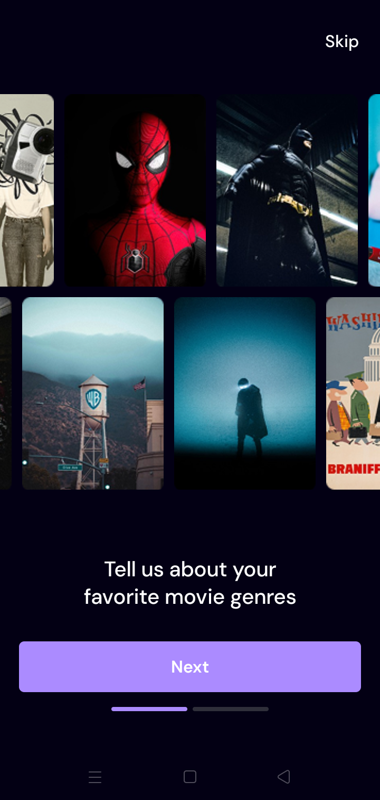
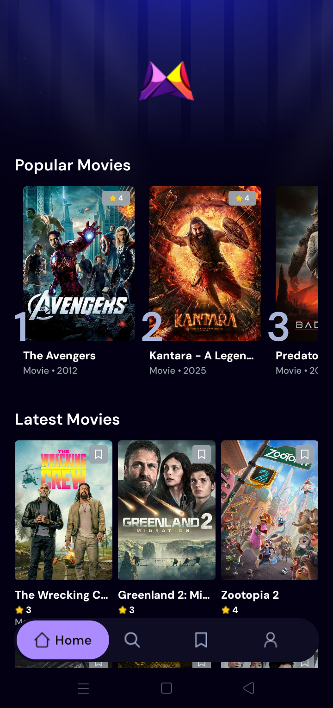
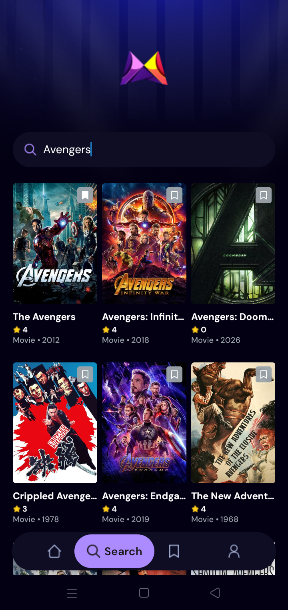
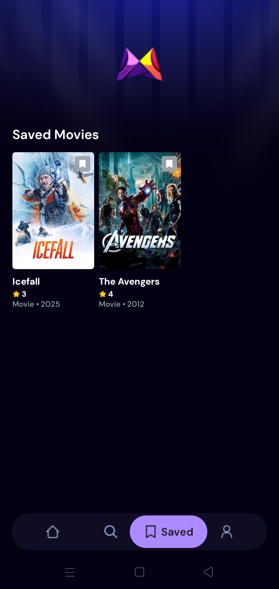
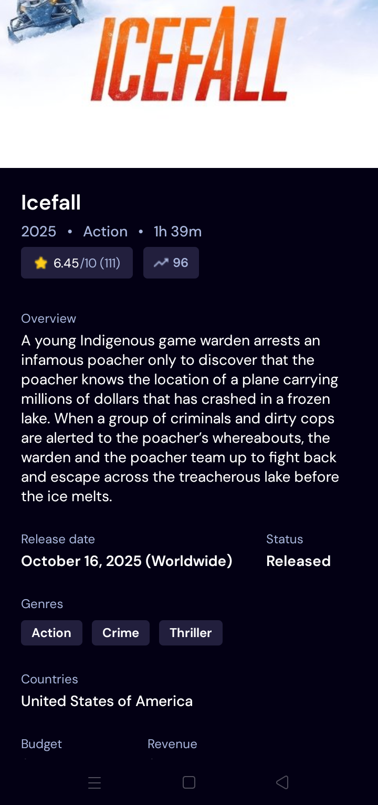

# MovieFlix — Mobile App


MovieFlix is a cross-platform mobile application built with **Expo**, **React-Native**, **TypeScript**, **Tailwind-CSS ( Nativewind )** and **Appwrite**. It showcases popular and latest movies, allows searching, saving favorites, and viewing detailed movie pages.
[**Live demo**](#) ( This repo contains the app source — run locally using the steps below. )
**Tech Stack:** Expo • React-Native • TypeScript • App-Router • Tailwind-CSS ( Nativewind ) • TMDB-API • Appwrite


## 📸 Screenshots
<table>
   <tr>
      <td align='center' style='padding-bottom: 20px'>
         <p style='margin-bottom: 10px'>Login-Page</p>
         
      </td>
      <td align='center' style='padding-bottom: 20px'>
         <p style='margin-bottom: 10px'>Home-Page</p>
         
      </td>
      <td align='center' style='padding-bottom: 20px'>
         <p style='margin-bottom: 10px'>Search-Page</p>
         
      </td>
   </tr>
   <tr>
      <td align='center' style='padding-top: 20px'>
         <p style='margin-bottom: 10px'>Saved-Page</p>
         
      </td>
      <td align='center' style='padding-top: 20px'>
         <p style='margin-bottom: 10px'>MovieDetails-Page</p>
         
      </td>
      <td align='center' style='padding-top: 20px'>
         <p style='margin-bottom: 10px'>Profile-Page</p>
         
      </td>
   </tr>
</table>


## ✨ Features
| Feature | Description |
|---------|-------------|
| 🎬 Browse Movies | Discover popular and latest movies with beautiful carousel |
| 🔍 Search | Find movies by title with real-time search results |
| 📺 Movie Details | View in-depth movie information and trailers |
| ❤️ Save Favorites | Bookmark movies to your personal collection |
| 🎨 Clean UI | Responsive design optimized for mobile devices |


## 🚀 Quick Start ( Local )
### Prerequisites
- Node.js v18+ installed
- npm or yarn package manager
- Expo CLI ( installed with npm )

### Installation Steps
### 1️⃣ Install Dependencies
```bash
npm install
```
### 2️⃣ Start Expo
```bash
npx expo start
```
### 3️⃣ Open the App
Choose one of the following options:
- **Android Emulator:** Press `a` to open on Android device/emulator
- **iOS Simulator:** Press `i` to open on iOS simulator (macOS only)  
- **Physical Device:** Scan the QR code with Expo Go app
---


## 📂 Project Structure
```
MovieFlix MobileApp/
├── app/                      # Main app routes & screens
│   ├── (tabs)/               # Tab-based navigation
│   │   ├── Home.tsx
│   │   ├── Search.tsx
│   │   ├── Saved.tsx
│   │   └── Profile.tsx
│   ├── movie/
│   │   └── [movieId].tsx     # Dynamic movie details page
│   └── _layout.tsx           # Root layout
├── components/               # Reusable UI components
│   ├── LatestMovieCard.tsx
│   ├── PopularMovieCard.tsx
│   └── TabsBarIcon.tsx
├── services/                 # API & backend services
│   ├── api.ts                # Movie API wrapper
│   ├── appwrite.ts           # Appwrite backend
│   ├── useFetch.ts           # Custom fetch hook
│   └── localStorage.ts       # Local storage
├── assets/                   # Images, icons & fonts
│   ├── images/
│   ├── icons/
│   └── fonts/
├── utils/                    # Shared utilities
│   ├── constants.ts
│   ├── icons.ts
│   ├── images.ts
│   └── interfaces.ts
├── tailwind.config.js        # Tailwind (nativewind) config
└── package.json
```


## 🔧 Environment & API Configuration
If the app uses an external API key or Appwrite backend, you'll need to configure credentials:
1. Create a `.env` file in the root directory (not included in repo)
2. Add your API credentials:
```env
EXPO_PUBLIC_API_KEY=your_movie_api_key
EXPO_PUBLIC_APPWRITE_ENDPOINT=your_appwrite_endpoint
EXPO_PUBLIC_APPWRITE_PROJECT_ID=your_project_id
```
3. Check `services/api.ts` and `services/appwrite.ts` for required keys and endpoints
---


## 🤝 Contributing
Contributions are welcome! Please follow these steps:
1. Fork the repository
2. Create a feature branch (`git checkout -b feature/amazing-feature`)
3. Commit your changes (`git commit -m 'Add amazing feature'`)
4. Push to the branch (`git push origin feature/amazing-feature`)
5. Open a Pull Request with a clear description
---


## 📝 Notes
- Icons and images are located in `assets/images/` and `assets/icons/`
- This project uses **file-based routing** inside the `app/` directory ( Expo-Router )
- Styling is done with **Tailwind-CSS** via **Nativewind** for React Native
---


## 📄 License
This repository does not include an explicit license. Add a `LICENSE` file if you intend to publish this project publicly.
---


### Made with ❤️
If you find this project helpful, please give it a ⭐ on GitHub!
[Back to Top ⬆️](#-movieflix--mobile-app)


# Welcome to your Expo app 👋
This is an [Expo](https://expo.dev) project created with [`create-expo-app`](https://www.npmjs.com/package/create-expo-app).


## Get started
1. Install dependencies
   ```bash
   npm install
   ```

2. Start the app
   ```bash
   npx expo start
   ```
In the output, you'll find options to open the app in a
- [development build](https://docs.expo.dev/develop/development-builds/introduction/)
- [Android emulator](https://docs.expo.dev/workflow/android-studio-emulator/)
- [iOS simulator](https://docs.expo.dev/workflow/ios-simulator/)
- [Expo Go](https://expo.dev/go), a limited sandbox for trying out app development with Expo
You can start developing by editing the files inside the **app** directory. This project uses [file-based routing](https://docs.expo.dev/router/introduction).


## Get a fresh project
When you're ready, run:
```bash
npm run reset-project
```
This command will move the starter code to the **app-example** directory and create a blank **app** directory where you can start developing.


## Learn more
To learn more about developing your project with Expo, look at the following resources:
- [Expo documentation](https://docs.expo.dev/): Learn fundamentals, or go into advanced topics with our [guides](https://docs.expo.dev/guides).
- [Learn Expo tutorial](https://docs.expo.dev/tutorial/introduction/): Follow a step-by-step tutorial where you'll create a project that runs on Android, iOS, and the web.


## Join the community
Join our community of developers creating universal apps.
- [Expo on GitHub](https://github.com/expo/expo): View our open source platform and contribute.
- [Discord community](https://chat.expo.dev): Chat with Expo users and ask questions.
